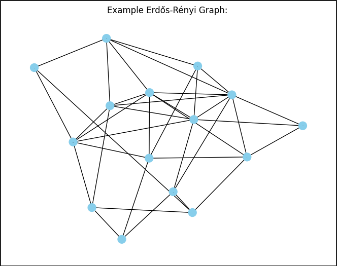
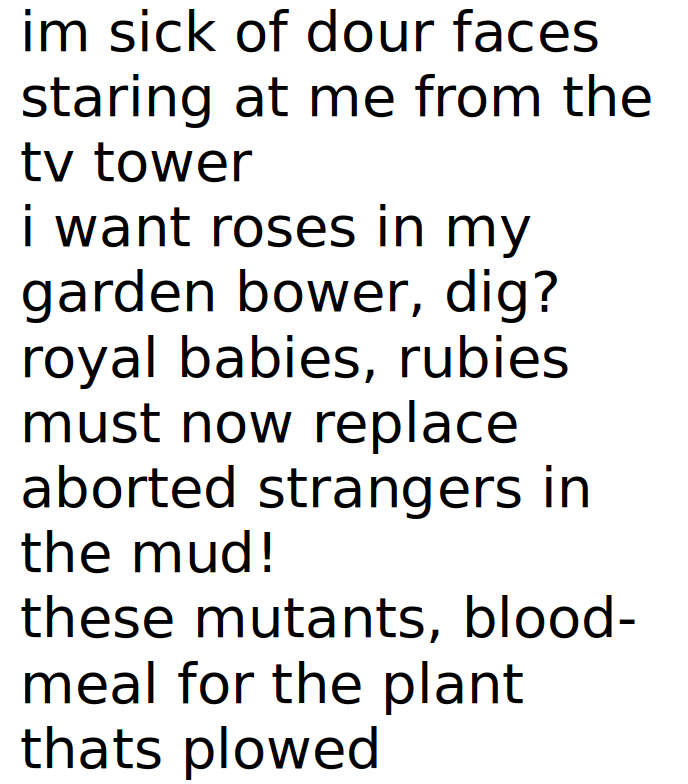

# Computational Methods in Science & Technology Course – AGH UST 2024

A repository containing solutions to laboratory tasks for the 4th-semester Computational Methods course in Computer Science. Topics covered include Linear Systems, Floating Point Arithmetic, Singular Value Decomposition, Non-Linear Equations, Simulated Annealing, Search Engines, and Fast Fourier Transformation.

---

## Major Projects
Some tasks are significantly larger and more detailed, often including reports and extensive documentation.

### Laboratory 2: Solving Linear Systems
Using Gaussian Elimination & LU Decomposition to solve linear systems. Additionally, this lab includes solving an electric circuit (treated as a graph) by finding electric currents using Kirchhoff's and Ohm's Laws and reducing dependent equations.

- [Instructions (Polish)](lab2MOWNIT/lab2_instructions.pdf)
- [Notebook with Solutions (Polish)](lab2MOWNIT/lab2_mownit_zielinski.ipynb)

    

### Laboratory 4: Simulated Annealing Metaheuristic
Applying the Simulated Annealing metaheuristic to solve various optimization problems.

- [Instructions (Polish)](lab4MOWNIT/tasks_instructions/lab4.pdf)

#### Task 1: Traveling Salesman Problem
- [Notebook with Solutions (English)](lab4MOWNIT/task1/TSP.ipynb)

    

#### Task 2: Reducing "Energy" of Binary Images
- [Report (English)](lab4MOWNIT/task2/binary_images_report/report.pdf)
- [Code in C++](lab4MOWNIT/task2/Binary-images)

#### Task 3: Solving Sudoku Puzzles
- [Notebook (English)](lab4MOWNIT/task3/sudokus.ipynb)

### Laboratory 6: Search Engine Creation
Building a search engine utilizing SVD, Cosine Similarity, and web crawling techniques.

- [Instructions (Polish)](lab6MOWNIT/lab6_instructions.pdf)
- [Report (English)](lab6MOWNIT/Search_Engine_Report-1.pdf)
- [Code in Python](lab6MOWNIT/initialization_engine)

### Laboratory 9: Template Matching and OCR
Implementing Template Matching and Optical Character Recognition using Discrete Fourier Transformation and FFT.

- [Instructions (Polish)](lab9MOWNIT/lab9_instructions.pdf)
- [Template Matching Notebook](lab9MOWNIT/task1.ipynb)
- [OCR Notebook](lab9MOWNIT/task2.ipynb)

    

---

## Smaller Projects
These are smaller tasks, some of which may not be fully developed.

### Laboratory 1: Computer Arithmetic Precision
Exploring different approaches to summing numbers in computer arithmetic.

- [Instructions](lab1MOWNIT/lab1_instructions.pdf)
- [Code in C++](lab1MOWNIT/main.cpp)

### Laboratory 3: Non-Linear Equation Approximation
Approximating solutions to non-linear equations using the Bisection, Newton, and Secant methods.

- [Instructions](lab3MOWNIT/lab3_instructions.pdf)
- [Notebook](lab3MOWNIT/lab3.ipynb)

### Laboratory 5: Singular Value Decomposition
Studying Singular Value Decomposition (SVD) techniques.

- [Instructions](lab5MOWNIT/lab5_instructions.pdf)
- [Notebook 1](lab5MOWNIT/task1.ipynb)
- [Notebook 2](lab5MOWNIT/task2.ipynb)

### Laboratory 7: Spectral Decomposition
Exploring the Power and Reversed Power methods for spectral decomposition.

- [Instructions](lab7MOWNIT/lab7_instructions.pdf)
- [Power Method Notebook](lab7MOWNIT/power_method.ipynb)
- [Reversed Power Method Notebook](lab7MOWNIT/reversed_power_method.ipynb)

---

This format is structured to be more visually appealing and readable. Feel free to paste this updated version into your README file.
